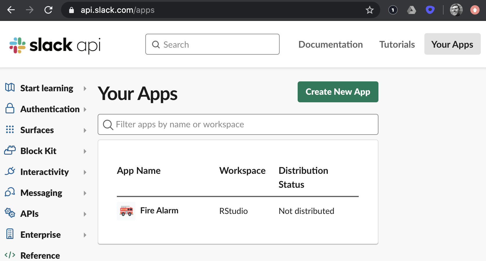
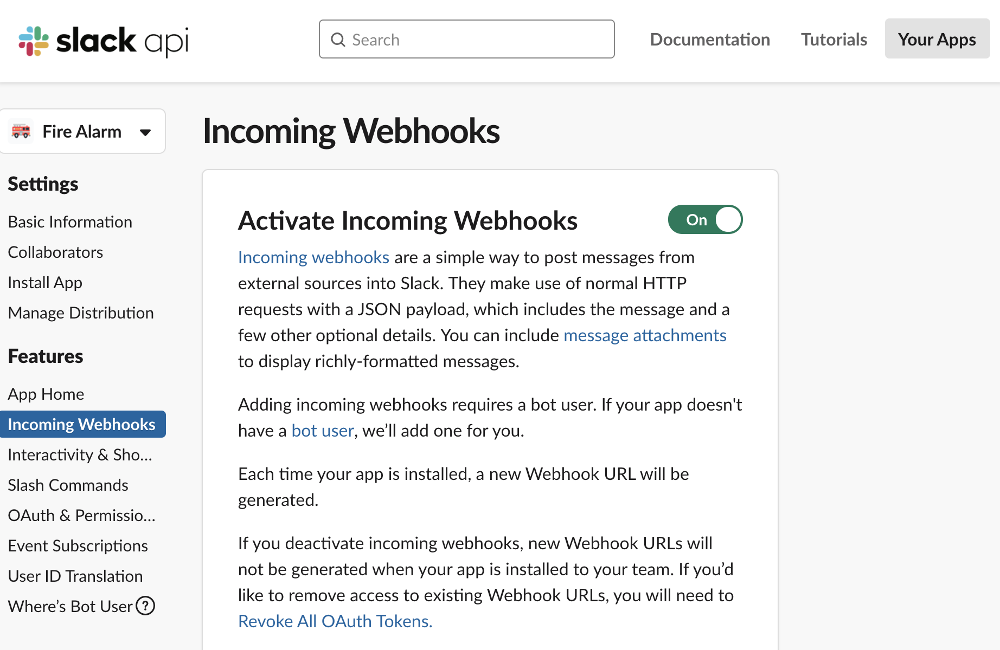
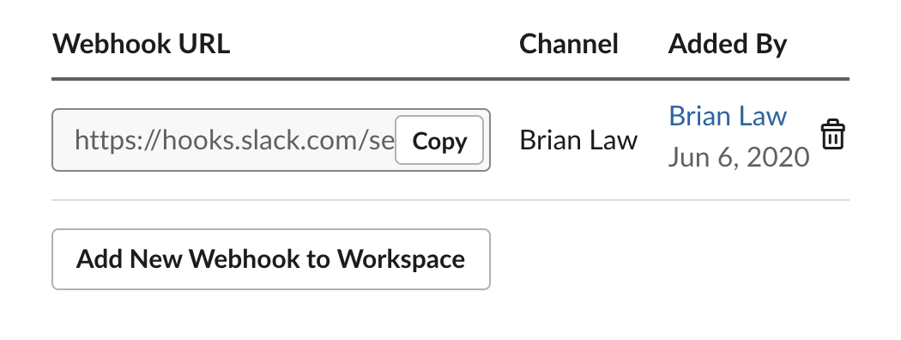
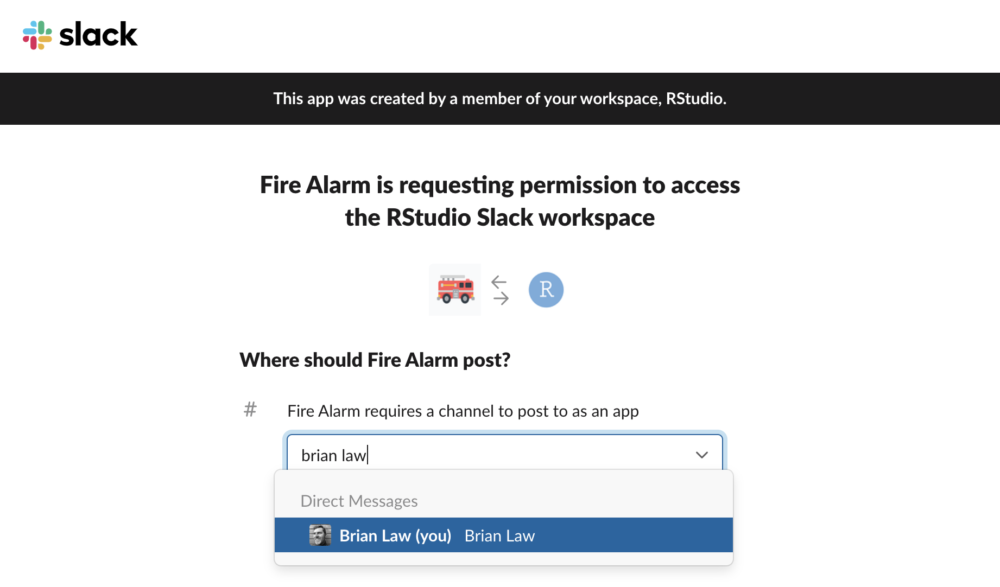
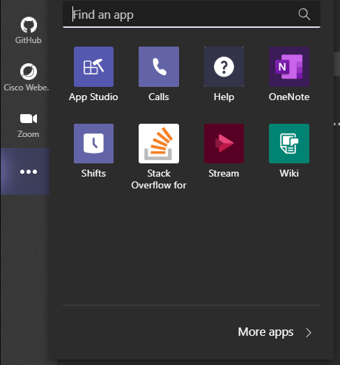
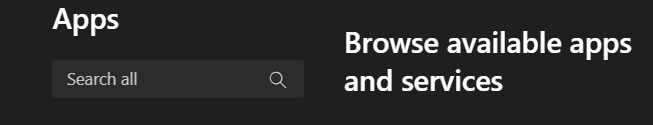
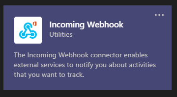
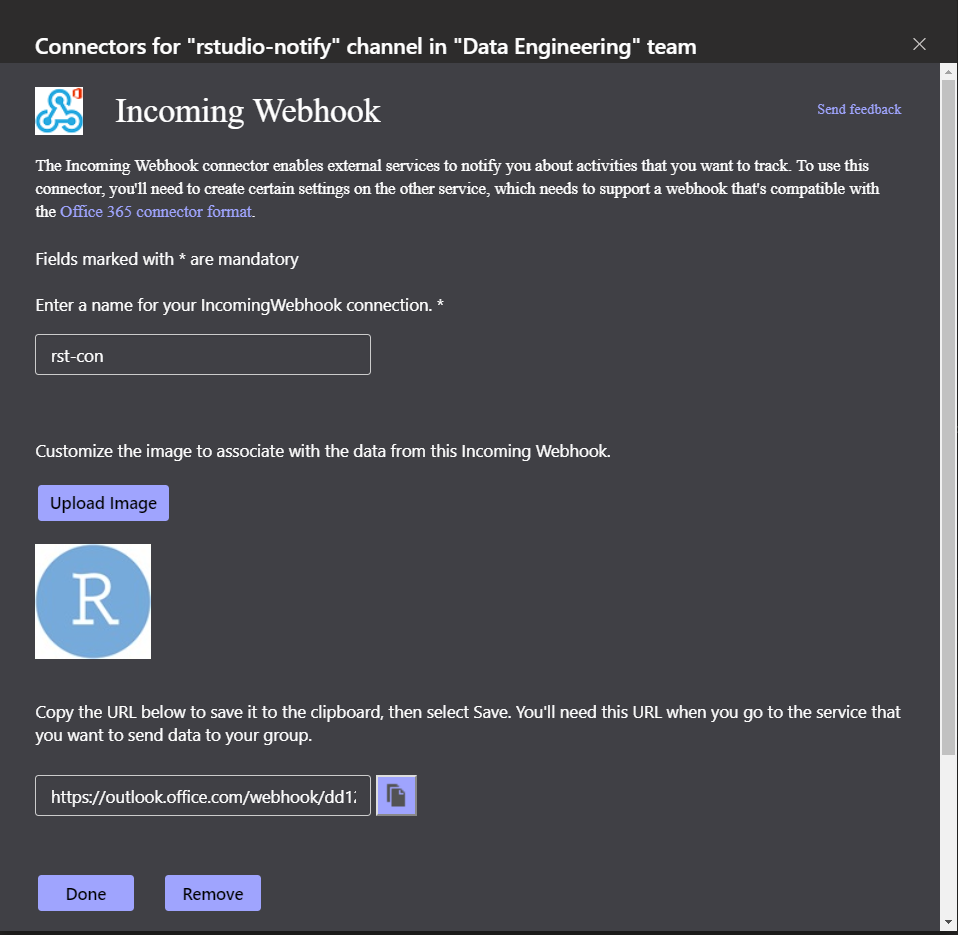
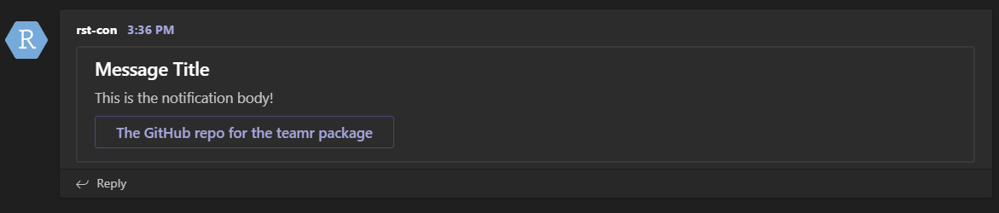

Motivation: sometimes we have a long-running R job that we leave alone while we do other things, and when this happens, it would be nice if R notified us when it was done. Below we'll walk through how to automate having R send you an: email, text message, Slack message, or MSFT Teams message.

### Email
```{r Email Chunk, echo=TRUE, eval=FALSE}
library(blastula)

# First let's build a rich HTML email using library(blastula)
owl <- compose_email(body = md(c("Hello from Hogwarts. <br><br> The polyjuice potion is complete!")))

# Second, store credentials to send our message via smtp; using gmail here but could be others.
create_smtp_creds_file(
  file = "gmail_creds",
  user = "name@gmail.com",
  provider = "gmail"
) # Note, a pop up will ask for the pwd for the user you provided

# Third, send the email using gmail here but could be others
owl %>%
  smtp_send(
    to = "someone@email.com",
    from = "name@gmail.com",
    subject = "Mischief Managed",
    credentials = creds_file("gmail_creds")
  )
```

### Text
If you prefer to get notifications via text messages then you can use the old trick to email a phone number. Each mobile phone plan provider has a slightly different format for how to do this and so the first step is to google "how to send email to text" and look yours up, e.g. AT&T's is the `ten-digit-phone-number@mms.att.net`. Let's run through an example.

```{r Text Chunk, echo=TRUE, eval=FALSE}
owl2 <- ""
owl2 %>%
  smtp_send(
    to = "6263540686@mms.att.net", 
    from = "rbrianlaw@gmail.com",
    subject = "Mischief Managed",
    credentials = creds_file("gmail_creds")
  )
```
Note that the text message above will only render the subject line currently but you can tinker further.

### Slack
Who knew that chat rooms would make such a comeback? If you use Slack and want to send a message there, you can do so using R. Here we'll walk through a stripped down method that posts messages directly to the Slack API using an RStudio library `httr`. If you want to get fancy there is also `library(slackr)`, which has more control and features. 

There are a few steps to set things up. First, you will need a Slack account. Second, go to api.slack.com/apps and login. 
{#id .class width=50% height=50%}

Third, click on "Create New App". Fourth, on the left sidebar, click on "Incoming Webhooks" and make sure "Activate Incoming Webhooks" is "On".

{#id .class width=50% height=50%}

Then, scroll to the bottom of the page and click "Add New Webhook to WorkSpace".

{#id .class width=50% height=50%}

Next, choose what Slack channel you want to generate a webhook to connect with, for example, your own Slack username, or a more general Slack channel at your company, like "cat_photos".

{#id .class width=50% height=50%}

Lastly, click on the "Copy" button to copy the webhook, which is what we'll use in our R code below to actually send the message.

{#id .class width=50% height=50%}


```{r echo=TRUE, eval=FALSE}
library(httr)
test_msg <- list(text="hello world!")

hook_to_me <- "https://hooks.slack.com/services/some_long_hash"
POST(hook_to_me, encode = "json", body = test_msg)

if (2 < 3) { # make this conditional
  hook_to_cats_channel <- "https://hooks.slack.com/services/some_long_hash"
  POST(hook_to_cats_channel, encode = "json", body = test_msg)
}
```

### MSFT Teams
The process of connecting to `MS Teams` in similar to connecting to `Slack` under the covers, using a webhook and leveraging the incoming webhook app, installed from the `MS Teams` app store. to get started, let's install the `teamr` package from `CRAN`, call the library and create our connection. 


Just like with `Slack`, you will first need an organizational `MS Teams` account. Secondly, navigate to the `add more apps` button from within the desktop client, which is the ellipsis below the pinned apps on the left task bar.

{#id .class width=50% height=50%}

Third, use the search bar, located in the upper left corner to search for the `Incoming Webhook` app

{#id .class width=50% height=50%}

click on the icon to bring up the install screen, where you can name the webhook, and assign it a specific channel within `MS Teams`

{#id .class width=50% height=50%}

After following the prompts to name the connection and assign it to a channel, you given the option of uploading an image so the webhook is easily recognizable when notifications are posted to your channel. Here, I have chosen to use an `RStudio` logo, which we will see later is makes it easier to know who or from where the post originates. After you are satisfied, click the done button in the bottom left corner. 

{#id .class width=50% height=50%}

The code to test your webhook in reasonably simple, and requires six lines of code. Although, in practice, we leverage many, if not all the customizible features provided within the `teamr` package. 

```{r echo=TRUE, eval=FALSE}

library(teamr)

con <- connector_card$new(hookurl = "https://outlook.office.com/webhook/dd123a74-6021-4c21-90e6-924002280771@60a5b34b-c976-4591-a955-f65531bb4d4b/IncomingWebhook/1593e918e0fd49a690783f08a81d365e/0eac4547-86ae-4373-98e5-f07f131160c8")

con$text("This is the notification body!")
con$title("Message Title")


con$add_link_button("The GitHub repo for the teamr package", "https://github.com/wwwjk366/teamr")

con$send()
#[1] TRUE
```


The final step, after running this code, is to verify everything is working as it should. The above code snippet sends a notification to `MS Teams`, with a link button pointing the package GitHub repo, from a webhook bot containing the `RStudio` logo. 

{#id .class width=50% height=50%}
